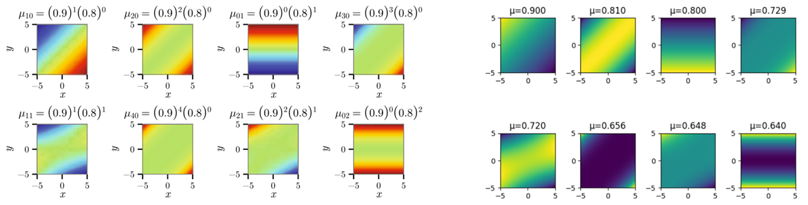
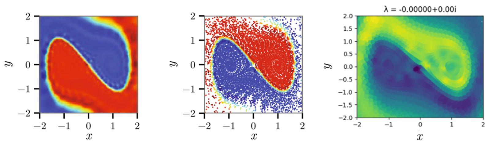

# EDMD_Koopman

## Description
Repository developed as part of the Bachelor's Thesis on ` An Overview of Koopman Operator Theory and a Data Driven Approach  for Understanding Dynamical Systems`, containing generic functions and usage examples for the implementation of the EDMD algorithm for the approximation of the Koopman Operator.

The implementation of this algorithm follows the paper [A Data–Driven Approximation of the Koopman
Operator: Extending Dynamic Mode Decomposition](https://arxiv.org/abs/1408.4408) by Matthew O. Williams, Ioannis G. Kevrekidis and Clarence W. Rowley, and replicates the analysis of some simple system with a Python code.

## Table of Contents

- [Abstract](#abstract)
- [Installation and Usage](#installation-and-usage)
- [Structure](#structure)
- [Results](#results)


## Abstract

The study of Dynamical Systems has always been at the core of models of real-world phenomena, but modeling complex systems is often hindered by several challenges, out of which the most commons are the nonlinearity of the dynamics and the lack of known governing equations.

Koopman Operator Theory was developed in the XX century and provides an alternative viewpoint to the study of dynamical systems, with an operator-based approach through which the complexity of the analysis shifts from the nonlinearity of the system to that of the infinite-dimensionality of the operator.

This approach not only gives us an operator to advance complex observables in time through the trajectories (rather than computing them after advancing the evaluation points), but also various tools to determine several properties of the dynamical system, from its stability to the characterization of the convergence to the attractors. 

Moreover, the modern innovations brought by data-driven approaches to the study of complex systems have led to the diffusion also in the field of Dynamical Systems. In fact, the infinite dimensionality of the Koopman Operator makes it instead well suited for data-driven regression tasks in the case of unknown dynamics.

The link between the theoretical analysis of the dynamical system and the data driven approach is given by the approximations of the Koopman Operator given by algorithms, such as Dynamic Mode Decomposition (DMD) and Extended Dynamic Mode Decomposition (EDMD).

## Installation and Usage
The code is supposed to be run on the following Python version:
```console
Python == 3.10
```

To install the required libraries you can install all the requirements with the following command:
```console
pip install -r requirements.txt
```

## Structure
- `images`: folder containing plots for visualization in [main.ipynb](main.ipynb) and in the [main results](#results) section.
- `utils`: folder containing the python files with the functions defined for the implementation of the DMD and EDMD algorithm.
- [`main.ipynb`](main.ipynb): file containing a usage example of the code included in the repository.


## Results

The code aims to recover the Koopman eigenfunctions for (nonlinear) dynamical systems, which are useful for the definition of a new coordinate system under which the system evolves linearly.  

The first analyzed system is a linear system, for which the recovered eigenfunctions and eigenvalues (right) closely resemble the theoretical result (left):


Similarly, the code can be applied to a more complex nonlinear system, such as the `Duffing Oscillator`, for which we are interested in the 0-eigenfunction, which is useful to define the basins of attraction of the system as well as other significant properties. Once again, we compare the theoretical results (left) with the ones obtained by the algorithm (right):



## Bibliography

- Williams, M. O., Kevrekidis, I. G., & Rowley, C. W. (2015). [A Data–Driven Approximation of the Koopman Operator: Extending Dynamic Mode Decomposition](http://dx.doi.org/10.1007/s00332-015-9258-5). *Journal of Nonlinear Science*, 25(6), 1307–1346. [https://doi.org/10.1007/s00332-015-9258-5](https://doi.org/10.1007/s00332-015-9258-5).
